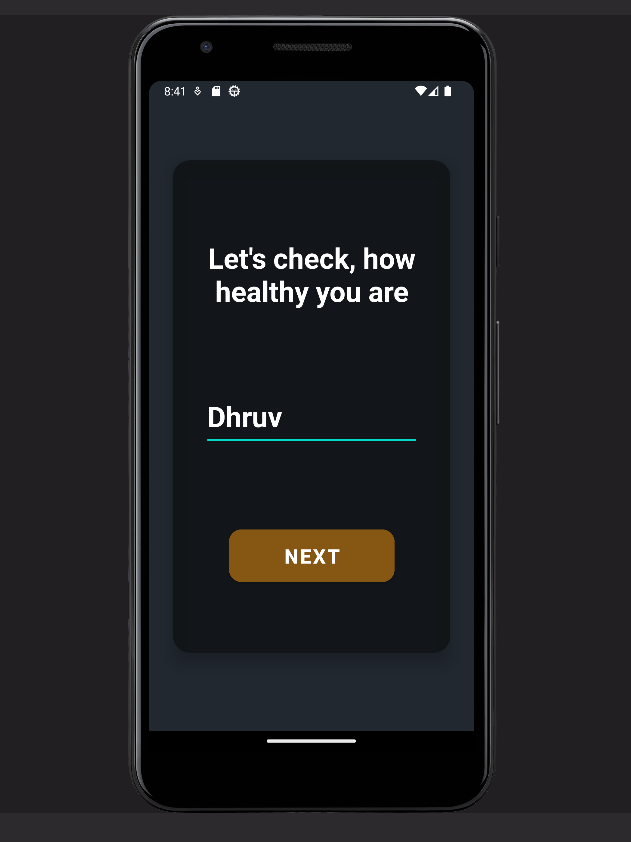
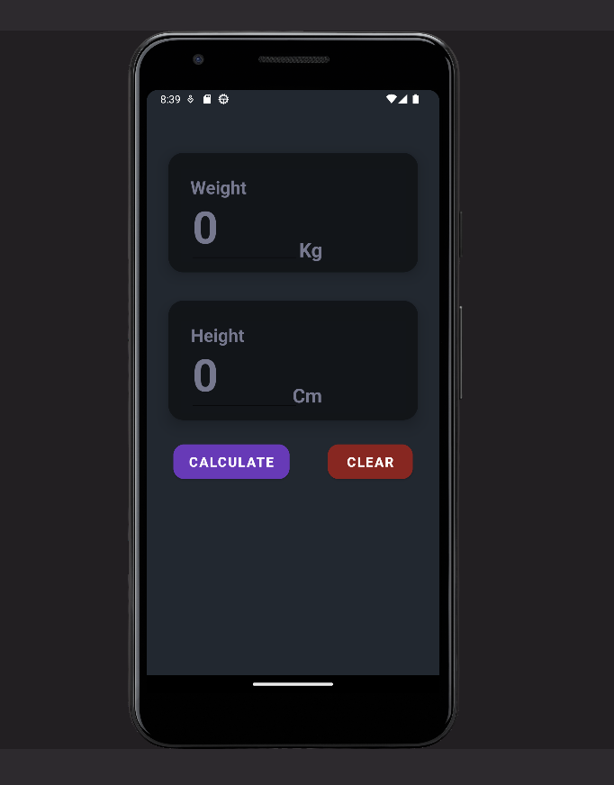
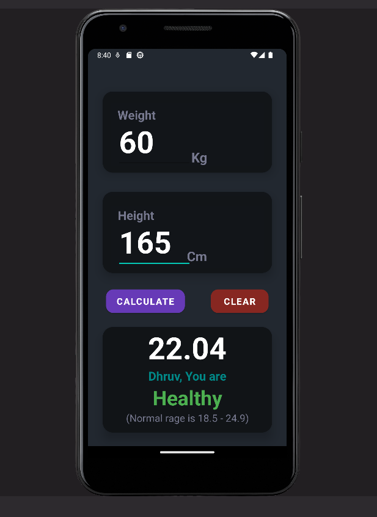

# BMICheckerApp

**Your Health in Your Hands** 🌟

Welcome to BMICheckerApp, a user-friendly BMI checker designed to give you insights into your health journey. Whether you're curious about your fitness level or aiming for a healthier lifestyle, this app has you covered.

## Screenshots

  

See the app in action! Discover the user-friendly interface that empowers you to make informed decisions about your health.

## Installation

1. Clone the repository: git clone https://github.com/yourusername/BMICheckerApp.git
2. Navigate to the project directory
3. Open the app in your preferred IDE or text editor.

## Usage

1. Run the app and input your weight and height.
2. Instantly calculate your BMI and get insights into your health status.
3. Use this information to make positive changes in your lifestyle.

## Contributing

Contributions are welcome! If you'd like to improve the app or add new features, please feel free to submit a pull request.

## License

This project is licensed under the [MIT License](LICENSE).

---

Empower yourself with BMICheckerApp and take proactive steps towards a healthier life! 🌈🏋️‍♀️

